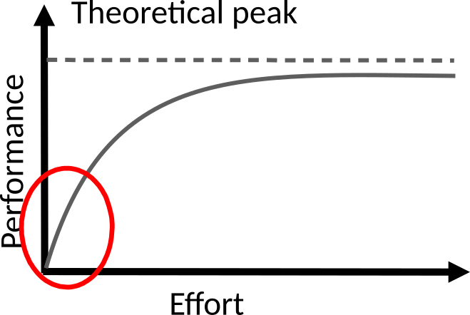
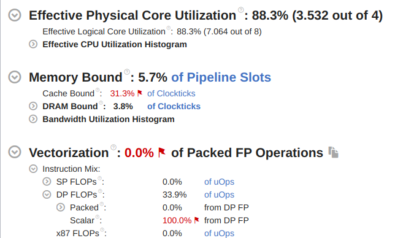
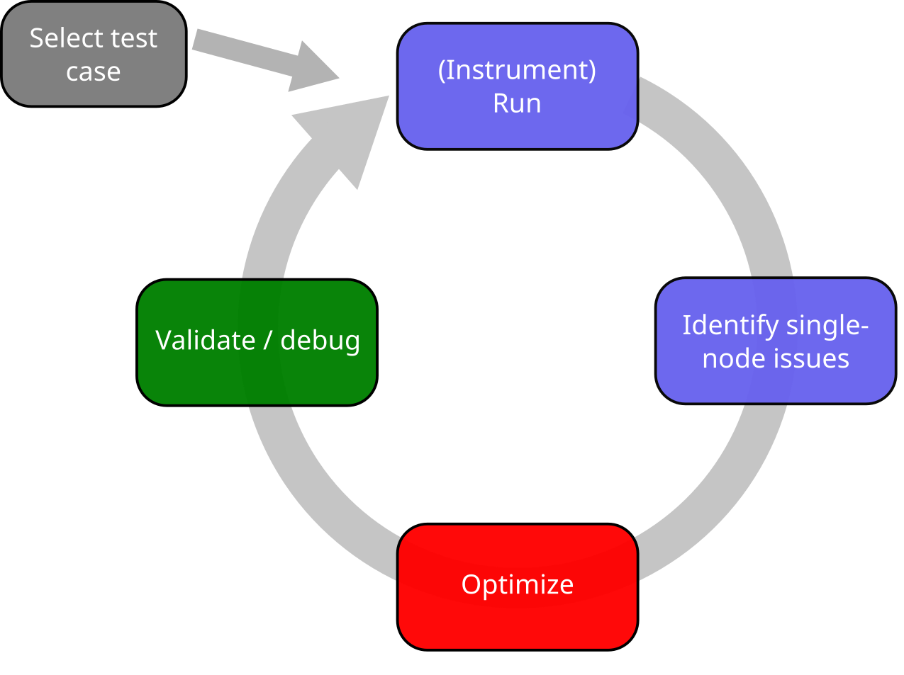
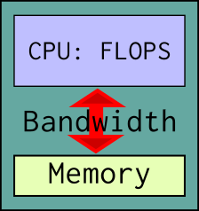
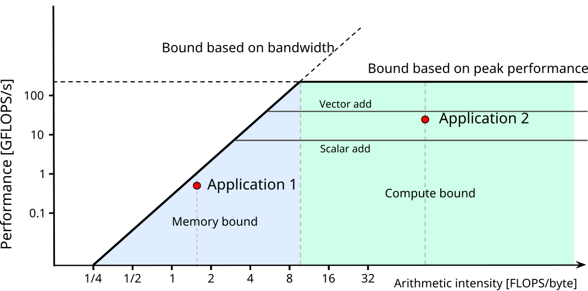

<!--
SPDX-FileCopyrightText: 2021 CSC - IT Center for Science Ltd. <www.csc.fi>

SPDX-License-Identifier: CC-BY-4.0
-->

---
title:  Overview of performance engineering
event:  Node-level Performance Optimization @ CSC
date:   2024-05
lang:   en
---


# Course outline

- Analyzing and understanding performance issues
    - awareness of modern CPUs
- Improving performance through vectorization
- Improving performance through memory optimization
- Improving performance though advanced threading techniques


# Why worry about application performance?

- Obvious benefits
    - better throughput ⇒ more science
    - cheaper than new hardware
    - save energy, compute quota, money etc.
- ...and some non-obvious ones
    - potential cross-disciplinary research with computer science
    - deeper understanding of application


# Factors affecting performance in HPC

- Single node performance
    - single core performance
    - threading (and MPI within a node)
- Communication between nodes
- Input/output to disk


# How to improve single node performance?

<div class=column style="width:52%">
- Choose good algorithm
    - e.g. $O(N \mathrm{log} N)$ vs. $O(N^2)$
    - remember also the prefactor!
- Use high-performance libraries
    - linear algebra (BLAS/LAPACK), FFTs, ...
</div>
<div class=column style="width:46%">
```bash
./fibonacci 20
With loop, Fibonacci number i=20 is 6765
Time elapsed 79 ums
With recursion, Fibonacci number i=20 is 6765
Time elapsed 343773 ums
```
</div>

- Experiment with compilers and compiler options
    - there is no single best compiler nor a set of options for all use
      cases
- Experiment with threading options
    - thread pinning, loop scheduling, ...
- Optimize the program code


# How to improve single node performance?

<div class=column style="width:52%">
- Choose good algorithm
    - e.g. $O(N \mathrm{log} N)$ vs. $O(N^2)$
    - remember also the prefactor!
- Use high-performance libraries
    - linear algebra (BLAS/LAPACK), FFTs, ...
</div>
<div class=column style="width:46%">

{.center width=60%}
</div>

- Experiment with compilers and compiler options
    - there is no single best compiler nor a set of options for all use
      cases
- Experiment with threading options
    - thread pinning, loop scheduling, ...
- Optimize the program code


# Doesn't the compiler do everything?

- You can make a big difference to code performance with how you
  express things
  - <span style="color:var(--csc-blue)">Help the compiler</span>
    spot optimisation opportunities
  - <span style="color:var(--csc-blue)">Use your insight</span>
    of the application
    - language semantics might limit compiler
  - <span style="color:var(--csc-blue)">Remove obscure</span>
    (and most likely obsolete) "optimizations" in older code
    - simple code is the best, until otherwise proven
- This is a dark art, mostly: optimize on case-by-case basis
    - first, check what the compiler is already doing


# What the compiler is doing? {.table-colour}

<div class=column>
- Compilers have vast amount of heuristics for optimizing common
  code patterns
- Most compilers can provide a report of the optimizations they performed,
  with various levels of detail
    - see compiler manuals for all options
- Look into the assembly code with
  <br> `-S -fverbose-asm`

</div>
<div class=column>

| Compiler    |  Opt. report               |
| ----------- | -------------------------- |
| GNU         | `-fopt-info`               |
| Intel       | `-qopt-report`             |
| Clang       | `-Rpass=.*`                |

<br>

```
...
  vfmadd213pd %ymm0, %ymm2, %ymm10
  vfmadd213pd %ymm0, %ymm2, %ymm9
  vfmadd213pd %ymm0, %ymm2, %ymm8
...
```
</div>


# Measuring performance {.section}


# A day in life at CSC

<div class=column>
## CSC customer
- I’m running simulations with my Fortran code. It seems to perform much worse
  with the MKL library in the new system than with the IMSL library in the old
  system.

<br>

- No
</div>

<div class=column>
## CSC specialist
<br>
<br>
<br>
<br>
<br>

- Have you profiled your code?
</div>


# A day in life at CSC

- Profiled the code: 99.9% of the execution time was being spent on these
  lines:

```fortran
do i=1,n          ! Removing these unnecessary loop iterations reduced the
  do j=1,m        ! wall-time of one simulation run from 17 hours to 3 seconds…
    do k=1,fact(x)
      do o=1,nchoosek(x)
         where (ranktypes(:,:)==k)
            ranked(:,:,o)=rankednau(o,k)
         end where
      end do
    end do
  end do
end do
```


# Measuring performance

- First step should always be measuring the performance and finding
  performance critical parts
    - application can contain hundreds of thousands of lines of code,
      but typically a small part of the code (`~`10 %) consumes most
        (`~`90%) of the execution time
    - "Premature code optimization is the root of all evil!"
- Choose test case which represents a real production run
- Measurements should be carried out on the target platform
    - "toy" run on laptop may provide only limited information


# Profiling application

<div class=column style="width:54%">
- Applications own timing information
    - can be useful for big picture
- Performance analysis tools
    - provide detailed information about the application
    - find hot-spots (functions and loops)
    - identify causes of less-than-ideal performance
    - information about low-level hardware
    - **Intel VTune**, **AMD uProf**, perf, Tau, Scalasca, PAPI, ...
    - <http://www.vi-hps.org/tools/tools.html>
</div>

<div class=column style="width:44%">
<div style="font-size:0.7em">
```bash
 Orthonormalize:                54.219     0.003   0.0% |
  calc_s_matrix:                11.150    11.150   2.8% ||
  inverse-cholesky:              5.786     5.786   1.5% ||
  projections:                  18.136    18.136   4.6% |-|
  rotate_psi_s:                 19.144    19.144   4.8% |-|
 RMM-DIIS:                     229.947    29.370   7.4% |--|
  Apply hamiltonian:             9.861     9.861   2.5% ||
```
</div>


</div>


# Profiling application

- Collecting all possible performance metrics with a single run is not
  practical
    - simply too much information
    - profiling overhead can alter application behavior
- Start with an overview!
    - call tree information, what routines are most expensive?


# Sampling vs. tracing

- Sampling stops the execution at predetermined intervals and examines the
  state of the application at those points
    - lightweight, but may give skewed results
- Tracing records every event, e.g. function call
    - usually requires modification to the executable
        - these modifications are called instrumentation
    - more accurate, but may affect program behavior
    - generates lots of data


# Hardware performance counters

- Hardware performance counters are special registers on CPU that count
  hardware events
- They enable more accurate statistics and low overhead
    - in some cases they can be used for tracing without any extra
      instrumentation
- Number of counters is much smaller than the number of events that can be
  recorded
- Different CPUs have different counters
- In multi-user systems like HPC clusters kernel security settings may limit
  available counters


# PAPI

- Performance Application Programming Interface (PAPI) offers portable
  access to hardware counters found on most modern processors
- Consistent interface and methodology for collecting performance counter
  information
- Support for most major CPUs and GPUs
- Several performance analysis tools use PAPI underneath
    - API for collecting metrics within application
- Command line tools for investigating available counters *etc.*
    - `papi_avail`, `papi_native_avail`, `papi_mem_info`, ...


# Optimizing program {.section}

# Code optimization cycle

{.center width=60%}


# How to assess application's performance?

<div class=column>
- Two fundamental limits:
  - CPU's peak floating point performance
    - clock frequency
    - number of instructions per clock cycle
    - number of FLOPS per instruction
    - number of cores
    - *no real application achieves peak in sustained operation!*
  - main memory bandwidth
    - How fast data can be fed to the CPU
</div>

<div class=column>
{.center width=50%}
</div>


# How to assess application's performance?

- Example: vector summation (*axpy*)<br>
  <span style="color:var(--csc-blue); padding-left:8.6ex">
  `x[i] = ax[i] + y[j]`
  </span>
    - two FLOPS (multiply and add) per `i`
    - three memory references per `i`
    - with double precision numbers (8 bytes), arithmetic intensity is <br>
      $I=\frac{\mathrm{FLOPS}}{\mathrm{memory traffic}} =
      \frac{2}{3 \cdot 8} = 0.08$ FLOPS/byte
    - in Puhti, memory bandwidth is \~200 GB/s, so the
      **maximum performance** is \~16 GFLOPS/s
    - for comparison, the theoretical peak performance of a Puhti node is
      \~2600 GFLOPS/s


# How to assess application's performance?

- Example: matrix-matrix multiplication (NxN matrices)<br>
  <span style="color:var(--csc-blue); padding-left:8.6ex">
  `C[i,j] = C[i,j] + A[i,k] * B[k,j]`
  </span>
    - $2 N^3$ FLOPS
    - $3 N^2$ memory references
    - with double precision numbers, arithmetic intensity is
      $I=\frac{2 N}{3}$ FLOPS/byte
    - with large enough $N$, it is limited by peak performance
      - on Puhti, this limit is reached with $N \approx 3.9 \cdot 10^{12}$


# How to assess application's parallel performance?

- First step should always be to optimize single core performance
    - may affect computation / communication balance
- Maximize single node performance
    - dynamic scaling of clock frequency, shared caches etc. make
      scalability within a node a complex concept
    - example: independent computations in Puhti (no parallel
      overheads)
        - single core: 3.06 s
        - all of the cores: 4.25 - 4.44 s per core
<!-- Numbers from the affinity_test code -->
- Memory bound applications may benefit from undersubscribing the node


# Roofline model

<div class=column style="width:52%">
- simple visual concept for maximum achievable performance
    - can be derived in terms of arithmetic intensity $i$, peak performance
      $\pi$ and peak memory bandwidth $\beta$
$$
p = min \begin{cases}
\pi \\
\beta \times i
\end{cases}
$$
- machine balance = arithmetic intensity needed for peak performance
    - typical values 5-15 flops/byte
</div>

<div class=column style="width:46%">
{.center width=100%}
<br>

- additional ceilings can be included (caches, vectorization,
  threading)
</div>


# Roofline model

<div class=column>
- Model does not tell if a code can be optimized or not
    - App 1 may not be *fundamentally* memory bound, but only
    implemented badly (not using caches efficiently)
    - App 2 may *inherently* have no prospects for higher
    performance (performs only additions and not fused multiply adds)
- However, a roofline can be useful for guiding the optimization work
</div>
<div class=column>
{.center width=85%}
<br>
{.center width=75%}
</div>


# Roofline model

- How to obtain the machine parameters?
    - CPU specs
    - own microbenchmarks
    - special tools (Intel tools, Empirical Roofline Tool)
- How to obtain application's GFLOPS/s and arithmetic intensity?
    - pen and paper and timing measurements
    - performance analysis tools and hardware counters
    - *true* number of memory references can be difficult to obtain


# Take-home messages

- Mind the application performance: it is beneficial not only for you,
  but also to other users and the service provider
- Profile your code and identify its performance issues first, before
  optimizing anything
    - **"Premature code optimization is the root of all evil"**
- Modifying the code should be the last step in performance tuning
- Serial optimization is mostly about helping the compiler to optimize
  for the target CPU
- Roofline model can work as a guide for optimization


# Web resources

- Roofline performance model and Empiral Roofline Tool
    - <https://crd.lbl.gov/divisions/amcr/computer-science-amcr/par/research/roofline/>
- Web service for looking assembly output from multitude of compilers
    - <https://gcc.godbolt.org>

