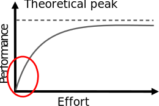
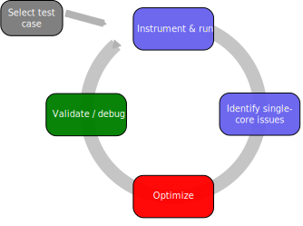
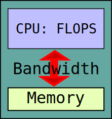
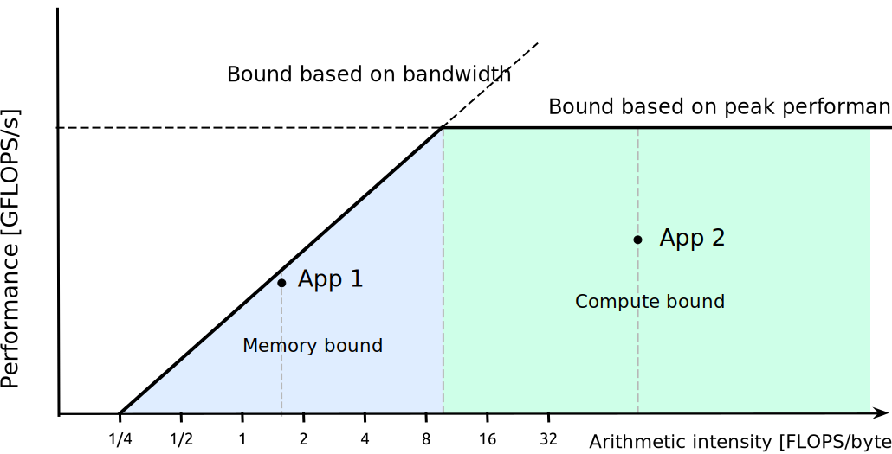
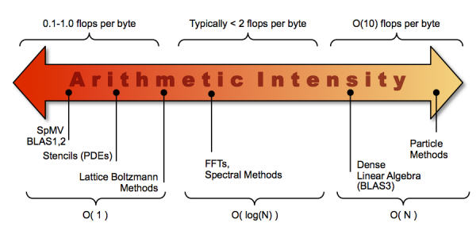

# Course outline

- Analyzing and understanding performance issues
- Improving performance through vectorization
- Improving performance through memory optimization
- Improving performance though advanced threading techniques


# Why worry about application performance?

- Obvious benefits
    - Better throughput => more science
    - Cheaper than new hardware 
    - Save energy, compute quota, money etc.
- ...and some non-obvious ones
    - Potential cross-disciplinary research with computer science
    - Deeper understanding of application

# Factors affecting performance in HPC

- Single node performance
    - single core performance
	- threading (and MPI within a node)
- Communication between nodes
- Input/output to disk

# How to improve single node performance?

<div class=column>
- Choose good algorithm
    - e.g. $O(N \mathrm{log} N)$ vs. $O(N^2$)
    - remember prefactor!
- Use high performance libraries
    - linear algebra (BLAS/LAPACK), FFTs, ...
- Experiment with compilers and compiler options
    - There is no single best compiler and set of options for all use
      cases
- Experiment with threading options
    - Thread pinning, loop scheduling, ...
- Optimize the program code
</div>
<div class=column>
```bash
./fibonacci 20
With loop, Fibonacci number i=20 is 6765
Time elapsed 79 ums
With recursion, Fibonacci number i=20 is 6765
Time elapsed 343773 ums
```
<br>
{.center width=80%}

</div>

# Doesn't the compiler do everything?

- You can make a big difference to code performance with how you
  express things
    - Helping the compiler spot optimisation opportunities
    - Using the insight of your application
    - Removing obscure (and obsolescent) “optimizations” in older code
        - Simple code is the best, until otherwise proven
- This is a dark art, mostly: optimize on case-by-case basis
    - First, check what the compiler is already doing

# Measuring performance {.section}

# A day in life at CSC

<div class=column>
**CSC customer**
<br>
<small>
I’m performing simulations with my Fortran code. It seems to perform much worse
with MKL library in the new system than with IMSL library in the old system.
<br>
<br>
No
</small>
</div>

<div class=column>
**CSC specialist**
<br>
<br>
<br>
<br>
<small>
Have you profiled your code?  
</small>
</div>

# A day in life at CSC

- Profiled the code: 99.9% of the execution time was being spent on these lines:

```fortran
do i=1,n          ! Removing these unnecessary loop iterations reduced the 
 do j=1,m         ! wall-time of one simulation run from 17 hours to 3 seconds…
    do k=1,fact(x)
      do o=1,nchoosek(x)
         where (ranktypes(:,:)==k)
            ranked(:,:,o)=rankednau(o,k)
         end where
      end do
    end do
  end do
end do
```


# Measuring performance

- First step should always be measuring the performance and finding
  performance critical parts
    - Application can contain hundreds of thousands of lines of code,
      but typically a small part of the code (`~`10 %) consumes most
        (`~`90%) of the execution time
	- “Premature code optimization is the root of all evil”
- Choose test case which represents a real production run
- Measurements should be carried out on the target platform
    - "Toy" run on laptop provides typically only limited information
	
# Profiling application

<div class=column>
- Applications own timing information
    - Can be useful for big picture
- Performance analysis tools
    - Provide detailed information about the application
	- Find hot-spots (functions and loops)
	- Identify causes of less-than-ideal performance
	- Information about low-level hardware
	- **Intel VTune**, **AMD uProf**, perf, Tau, Scalasca, PAPI, ...
	-  <http://www.vi-hps.org/tools/tools.html>
</div>
<div class=column>
<small>

```bash
 Orthonormalize:                    54.219     0.003   0.0% |
  calc_s_matrix:                    11.150    11.150   2.8% ||
  inverse-cholesky:                  5.786     5.786   1.5% ||
  projections:                      18.136    18.136   4.6% |-|
  rotate_psi_s:                     19.144    19.144   4.8% |-|
 RMM-DIIS:                         229.947    29.370   7.4% |--|
  Apply hamiltonian:                 9.861     9.861   2.5% ||
```
</small>


</div>

# Profiling application

- Collecting all possible performance metrics with single run is not practical
    - Simply too much information
    - Profiling overhead can alter application behavior
- Start with an overview!
    - Call tree information, what routines are most expensive?

# Sampling vs. tracing

- When application is profiled using sampling, the execution is stopped at 
  predetermined intervals and the state of the application is examined
    - Lightweight, but may give skewed results
- Tracing records every event, e.g. function call
    - Usually requires modification to the executable
        - These modifications are called instrumentation
    - More accurate, but may affect program behavior
    - Generates lots of data

# Hardware performance counters

- Hardware performance counters are special registers on CPU that count 
  hardware events
- They enable more accurate statistics and low overhead
    - In some cases they can be used for tracing without any extra 
      instrumentation

- Number of counters is much smaller than the number of events that can be 
  recorded
- Different CPUs have different counters

# Optimizing program {.section}

# Code optimization cycle

{.center width=60%}

# How to assess application's performance?

<div class=column>
- Two fundamental limits
- CPUs peak floating point performance
    - clock frequency
	- number of instructions per clock cycle
	- number of FLOPS per instruction
	- number of cores
	- no real application achieves peak in sustained operation
- Main memory bandwidth
    - How fast data can be fed to the CPU
</div>

<div class=column>
{.center width=50%}
</div>

# How to assess application's performance?

- Example: maximum performance of **axpy** `x[i] = a x[i] + y[j]`
    - Two FLOPS (multiply and add)
	- Three memory references
	- With double precision numbers arithmetic intensity
      $I=\frac{\mathrm{FLOPS}}{\mathrm{memory traffic}} =
      \frac{2}{3*8}=0.08$ FLOPS/byte
	- In Puhti, memory bandwidth is \~200 GB/s, so maximum performance
      is \~16 GFLOPS/s
	- Theoretical peak performance of Puhti node is \~2600 GFLOPS/s

# Roofline model

<div class=column>
- Simple visual concept for maximum achievable performance
    - can be derived in terms of arithmetic intensity $I$, peak performance
      $\pi$ and peak memory bandwidth $\beta$
$$
P = min \begin{cases}
\pi \\
\beta \times I
\end{cases}
$$

- Machine balance = arithmetic intensity needed for peak performance
    - Typical values 5-10 FLOPS/byte
- Additional ceilings can be included (caches, vectorization,
  threading)

</div>
<div class=column>
{.center width=90%}
<!-- https://crd.lbl.gov/departments/computer-science/par/research/roofline/introduction/ -->
<br>
{.center width=70%}


</div>

# Roofline model

<div class=column>
- Model does not tell if code can be optimized or not
    - App 1 may not be *fundamentally* memory bound, but only
	implemented badly (not using caches efficiently)
	- App 2 may not have *fundamentally* prospects for higher
	performance (performs only additions and not fused multiply adds)
- However, can be useful for guiding the optimization work
</div>
<div class=column>
{.center width=90%}
</div>

# Roofline model

- How to obtain the machine parameters?
    - CPU specs
	- own microbenchmarks
	- special tools (Intel tools, Empirical Roofline Tool)
- How to obtain application GFLOPS/s and arithmetic intensity?
    - Pen and paper and timing measurements
	- Performance analysis tools and hardware counters

# Take-home messages

- Mind the application performance: it is for the benefit of you,
  other users and the service provider
- Profile the code and identify the performance issues first, before
  optimizing anything
    - “Premature code optimization is the root of all evil”
- Optimizing the code should be the last step in performance tuning
- Serial optimization is mostly about helping the compiler to optimize
  for the target CPU
- Roofline model can work as a guide in optimization

# Web resources

- Roofline performance model and Empiral Roofline Tool
    - <https://crd.lbl.gov/departments/computer-science/par/research/roofline/>

