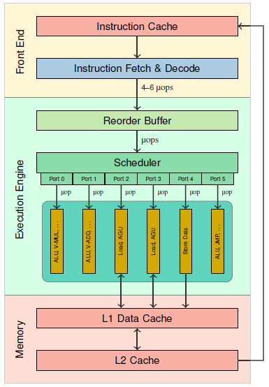
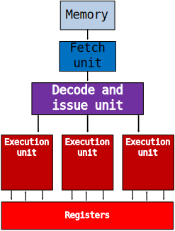
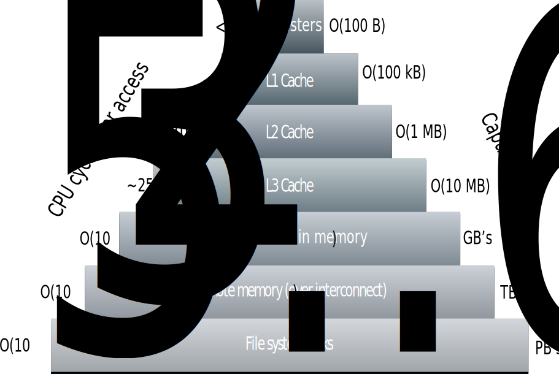
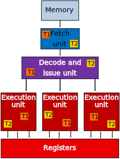
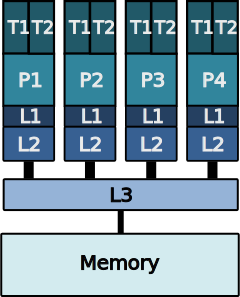
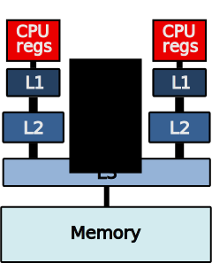

# Modern CPU core {.section}

# von Neumann architecture

- A CPU core is still largely based on the von Neumann model
    - sequency of operations (instructions) performed on given data
    - instructions and data are fetched from memory into registers in CPU
    - ALU performs operations on data in registers
    - Result is stored back to memory
- From an external point of view, operations are executed sequentially

<!--Image copyright By Kapooht - Own work, CC BY-SA 3.0, -->
{.center width=60%}

# Modern CPU core

- Internally, each core is highly complex
- **Superscalar out-of-order** instruction execution
- **SIMD** instructions
- Multiple levels of hierarchical **cache memory**

<!-- Image copyright Public Domain -->
{.center width=45%}

# How CPU core operates?

- Clock frequency determines the pace at which CPU works
- Zero to **N** instructions start at each clock cycle
- Instruction latency = number of clock cycles that are required for
  completing the execution
- Instruction throughput = number of clock cycles to wait before
  starting same kind of instruction again
    - Throughput can be much smaller than the latency
    - Sometimes given as cycles per instruction (CPI) or its inverse, instructions per cycle (IPC)

# Fetch-decode-execute cycle

- Instructions are executed in stages
- Fetch (F): control unit fetches instruction from memory
- Decode (D): decode the instruction and determine operands
    - Instructions are broken into uops
- Execute (E): perform the instruction 
    - Utilize ALU or access memory
- Enables simpler logic and **pipelining** the operations

{.center width=50%}

  
# Pipelining

- Instruction execution and arithmetic units can be *pipelined*
    - Instruction execution: work on multiple instructions
      simultaneously
    - Arithmetic units: execute different stages of a an instruction
      at the same time in an assembly line fashion
    - Together: one result per cycle after the pipeline is full
- Within the pipeline, hardware can execute instructions in different 
 order than they were issued (**out-of-order** scheduling)
- Requires complicated software (compiler) and hardware
   to keep the pipeline full
- Conditional branches can cause the pipeline to stall
        
# Pipelining: example

- Wind-up and wind-down phases: no instructions retired
- First result available after 5 cycles, total time 7 cycles compared
  to 15 cycles without a pipeline
- Real pipeline in modern CPU cores can be much more complex

{.center width=70%}

# Superscalar execution

- Hardware Instruction Level Parallelism (ILP)
- Multiple instructions per cycle issued to the multiple execution
  units
- Hardware data dependency resolution preserve sequential execution
  semantics
    - Actual execution may be out-of-order
- Pipelining and superscalar execution allow instruction throughputs
less than one

<!-- Image copyright CSC, see LICENSE -->
{.center width=60%}

# Latency, throughput, and concurrency

- In order to keep the pipeline full and multiple execution units fully utilized, 
  there needs to be enough independent instructions that can be run concurrently
- Little's law
$$
\textrm{Concurrency} = \textrm{Latency} \times \textrm{Throughput}
$$
- Example: vector fused multiply add (vfma) in Intel Cascade Laked
    - latency 4 cycles, throughput 2 IPC
    - minimum of eight independent instructions are needed to achieve maximum throughput

# Vectorization

- Modern CPUs have SIMD (Single Instruction, Multiple Data) units and instructions 
    - Operate on multiple elements of data with single instructions
- AVX2 256 bits = 4 double precision numbers
- AVX512 512 bits = 8 double precision numbers
    - single AVX512 fused multiply add instruction can perform 16 FLOPS

 
<!-- Image copyright CSC, see LICENSE -->
{.center width=70%}
  
# Cache memory

- In order to alleviate the memory bandwidth bottleneck, CPUs have multiple levels of cache memory
    - when data is accessed, it will be first fetched into cache
    - when data is reused, subsequent access is much faster
- L1 cache is closest to the CPU core and is fastest but has smallest capacity
- Each successive level has higher capacity but slower access

<!-- Image copyright CSC, see LICENSE -->
{.center width=90%}

  
# Symmetric Multithreading (SMT)

- It is difficult to fill-in all the available hardware resources in a 
  CPU core
    - Pipeline stalls due to main memory latency, I/O, etc.
- To maximize hardware utilization, several hardware threads can be executed on a single core
    - Seen as logical cores by OS
- Benefits depend on the application, and SMT can also worsen the performance

  

<!-- Image copyright CSC, see LICENSE -->
{.center width=70%}

# Multicore CPU schematic

- The multicore CPU is packeted in a socket
- Typically, L1 and L2 caches are private per core, and L3 cache is shared 
  between set of cores
- All cores have shared access to the main memory

<!-- Image copyright CSC, see LICENSE -->
{.center width=60%}

# Cache coherency

- With private caches per core, hardware needs to ensure that the data is consistent between the cores
- When a core writes to a cache, CPU may need to update the caches of other cores
    - Possibly expensive operation

<!-- Image copyright CSC, see LICENSE -->
{.center width=50%}

   
# NUMA architectures

- A node can have multiple sockets with memory attached to each socket
- Non Uniform Memory Access (NUMA)
    - All memory within a node is accessible, but latencies and bandwidths vary
- Hardware needs to maintain cache coherency also between different NUMA nodes (ccNUMA)

<!-- Image copyright CSC, see LICENSE -->
{.center width=70%}

# Summary

- Modern multicore CPUs are complex beasts
- In order to maximally utilize the CPU, application needs to:
    - use multiple threads (or processes)
    - utilize caches for feeding data to CPU at fastest possible pace
    - keep the pipeline full and utilize instruction level parallelism
    - use vector instructions for maximizing FLOPS per instruction

# Web resources

- Detailed information about processor microarchitectures: 
    - <https://en.wikichip.org/wiki/WikiChip>
    - <https://uops.info/>
- Agner's optimization resources <https://www.agner.org/optimize/>
    
    
