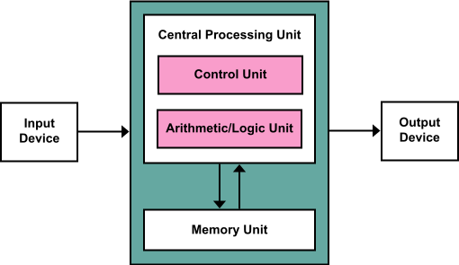
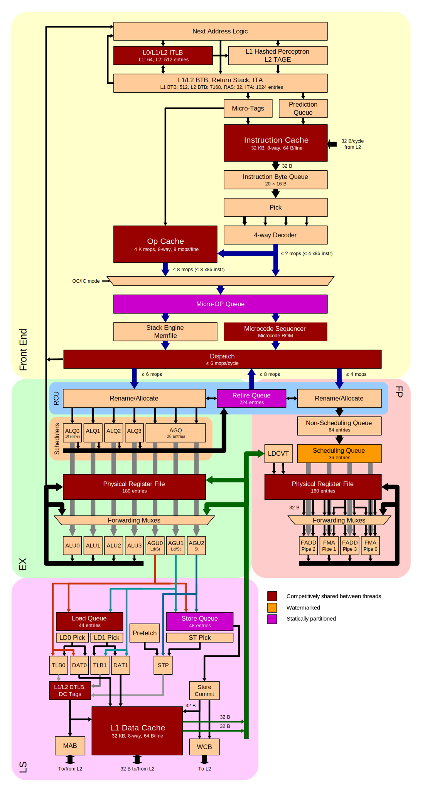
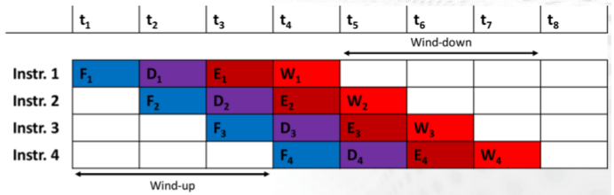
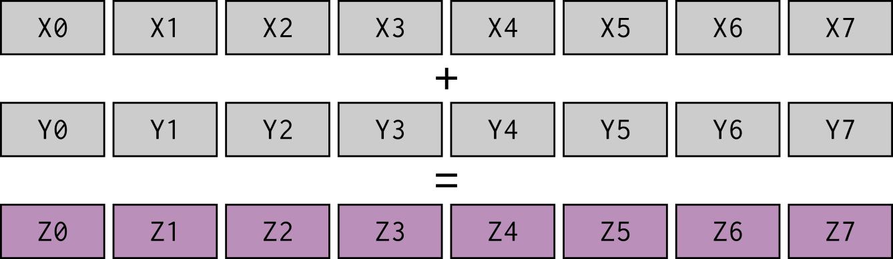
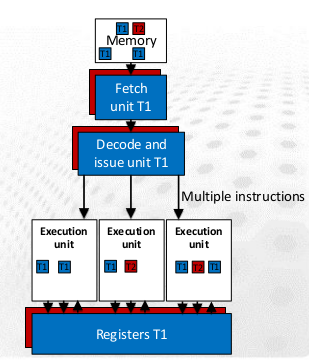
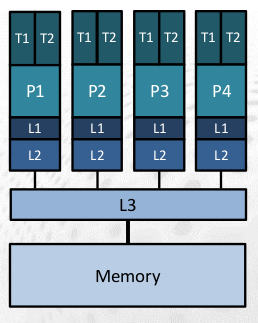
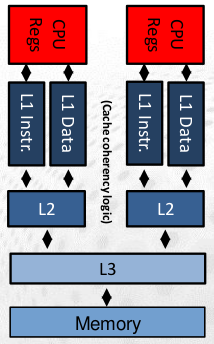
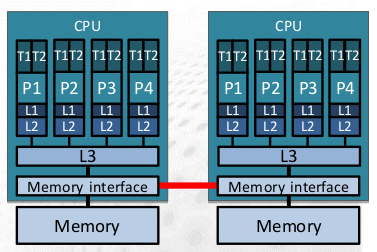

# Modern CPU core {.section}

# von Neumann architecture

- A CPU core is still largely based on the von Neumann model
    - sequency of operations (instructions) performed on given data
	- instructions and data are fetched from memory into registers in CPU
	- ALU performs operations on data in registers
	- Result is stored back to memory
- From an external point of view, operations are executed sequentially

<!--By Kapooht - Own work, CC BY-SA 3.0, -->
<!--https://commons.wikimedia.org/w/index.php?curid=25789639 -->
{.center width=80%}

# Modern CPU core

- Internally, each core is highly complex:
    - **Superscalar out-of-order** instruction execution capabilities
	- **SIMD** instructions
	- Multiple levels of hierarchical **cache memory**

{.center width=50%}

# How CPU core operates?

- Clock frequency determines the pace at which CPU works
- Instructions are started at each clock cycle
- Instruction latency = number of clock cycles that are required for
  completing the execution
- Instruction throughput = number of clock cycles to wait before
  starting instruction again
    - Throughput can be much smaller than the latency

# Fetch-decode-execute cycle

- Instructions are executed in successive steps
    - Fetch (F): control unit fetches instruction from memory
	- Decode (D): decode the instruction and determine operands
	- Execute (E): perform the instruction. If instruction involves
      arithmetic or logic ALU is utilized
- Benefit: simpler operands allow for simpler logic and allow
  **pipelining** the operations

{.center width=50%}

  
# Pipelining

- Both instruction execution and arithmetic units can be *pipelined*
    - Instruction execution: work on multiple instructions
      simultaneously
	- Arithmetic units: execute different stages of a an instruction
      at the same time in an assembly line fashion
	- Both: one result per cycle after the pipeline is full
- Requires complicated software (compiler) and hardware
  (**out-of-order** scheduling) to keep the pipeline full
    - Conditional branches can cause the pipeline to stall
		
# Pipelining: example

- Wind-up and wind-down phases: no instructions executed
- First result available after 4 cycles, total time 8 cycles compared
  to 16 cycles without a pipeline
  
{.center width=70%}

# Superscalar execution

- Hardware Instruction Level Parallelism (ILP)
- Multiple instructions per cycle issued to the multiple execution
  units
- Hardware data dependency resolution preserve sequential execution
  semantics
    - Actual execution may be out-of-order
- Pipelining and superscalar execution allow instruction throughputs
less than one

{.center width=70%}

# Vectorization

- Modern CPUs have SIMD (Single Instruction, Multiple Data) units and instructions 
    - Operate on multiple elements of data with single instructions
- AVX2 256 bits = 4 double precision numbers
- AVX512 512 bits = 8 double precision numbers
    - single AVX512 fused multiply add instruction can perform 16 FLOPS

<!--{.center width=70%} -->

 
{.center width=70%}
  
# Cache memory

- In order to alleviate the memory bandwidth bottleneck, CPUs have multiple levels of cache memory
    - when data is accessed, it will be first fetched into cache
	- with reuse subsequent access is much faster
- L1 cache is closest to the CPU core and is fastest but has smallest capacity
- Each successive level has higher capacity but slower access

  

{.center width=90%}

# Symmetric Multithreading (SMT)

- It is difficult to fill-in all the available hardware resources in a CPU core continously
    - Pipeline stalls due to main memory latency, I/O, etc.
- To maximize the use of available hardware resources, several hardware threads can be executed on a single core
- Benefits depend on the application, and SMT can also worsen the performance

  

{.center width=70%}

# Introduction to modern multicore CPUs {.section}

# Multicore CPU schematic

- The multicore CPUs are packeted in sockets
- Modern multicore CPUs have typically private L1 and L2 caches per core, and L3 cache that is shared between a set of cores. 
- All cores have shared access to the main memory

{.center width=60%}

# Cache coherency

- With private caches per core, hardware needs to ensure that the data is consistent between the cores
- When a core writes to a cache, CPU may need to update the caches of other cores
    - Possibly expensive operation

{.center width=60%}

   
# NUMA architectures

- Many current supercomputer nodes have two sockets with main memory attached to the sockets
- System has Non Uniform Memory Access (NUMA)
    - All memory within a node is accessible, but latencies and bandwidths vary
- Hardware needs to maintain cahce coherency also between different NUMA nodes (ccNUMA)

{.center width=60%}

# Summary

- Modern multicore CPUs are complex beasts
- In order to maximally utilize the CPU, application needs to:
    - use multiple threads (or processes)
	- utilize caches for feeding data to CPU at fastest possible pace
	- keep the pipeline full and utilize instruction level parallelism
	- use vector instructions for maximizing FLOPS per instruction

# Web resources

- Agner's optimization resources
    - <https://www.agner.org/optimize/>
	
	
