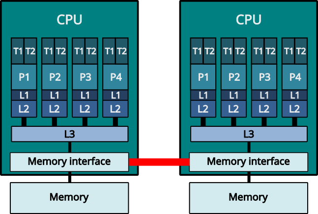
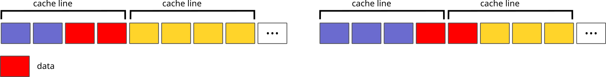
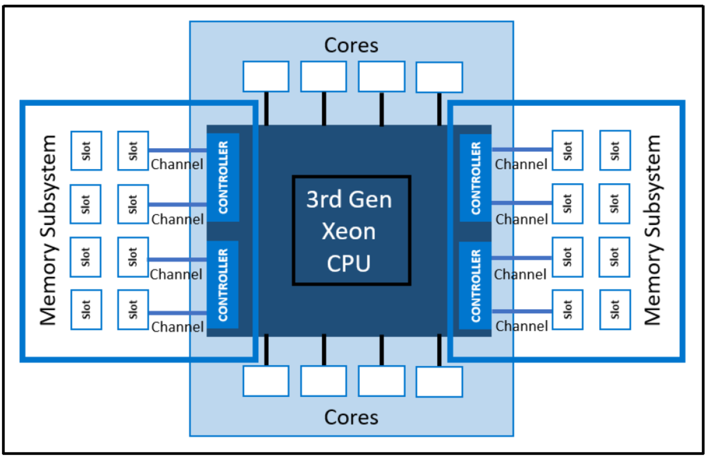
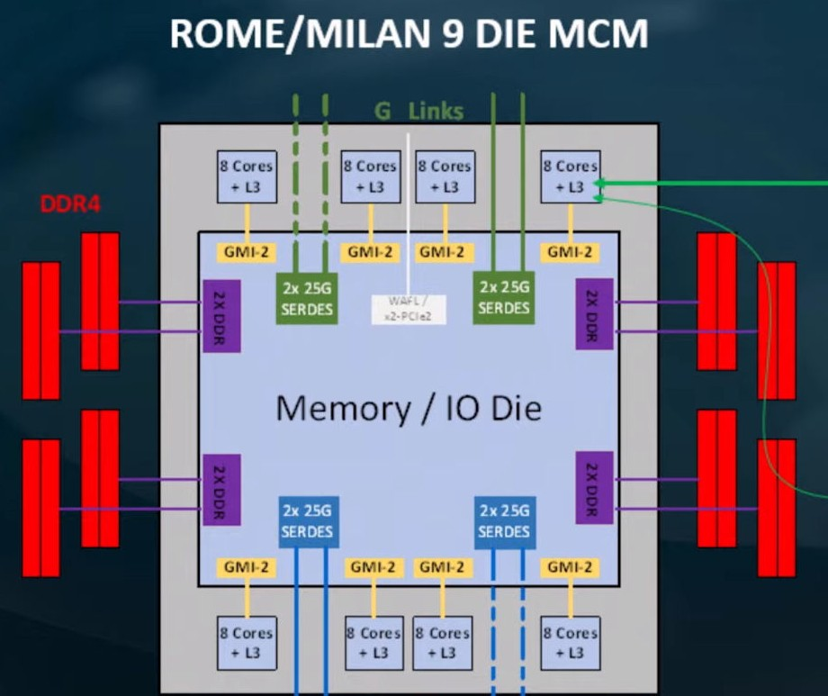
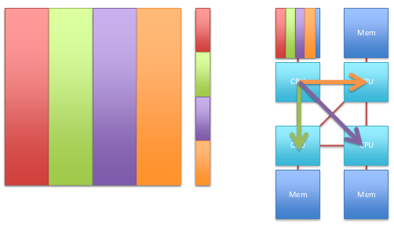
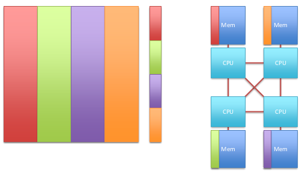

# Main memory {.section}

# Learning objectives

- Know how to estimate theoretical memory bandwidth
- Be able to avoid performance issues from first touch memory allocation
- Control thread affinity

# Memory subsystem

<div class=column style=width:55%>
- Hierarchy of memories
- Main memory with non-uniform access (NUMA)
    - "Local" memory (same NUMA domain)
    - "Remote" memory (other NUMA domain)
- Multiple levels of caches (L1, L2, L3)
- Main memory is typically the slowest component in modern CPU (neglecting I/O) 
</div>
<div class=column style=width:43%>
<!-- Image copyright CSC, see LICENSE -->
{.center width=80%}
</div>

# Memory alignment

- Computer memory can be thought as one dimensional array of bytes
    - Each slot in the array (=byte) has an address
- In principle, data *i.e.* content of a variable can be stored in any slot
- The data is said to be **N**-byte aligned if its memory address is integer multiple of **N**
- In practice, memory is accessed in units of cache lines (typically 64 bytes), with corresponding alignment  (*i.e.* 64 bytes)

# Memory alignment

{.center width=80%}
<br>

- If data is badly aligned and spans over cache line (*e.g.* 4 byte `float` would have 63 byte
  alignment) performance may suffer
- In practice, language standards and compilers force *natural* alignment so that with
      scalar data bad alignment is rarely an issue

# Memory controller

<div class=column style=width:60%>
- Coordinates the transfer of bits between memory DIMMs and the CPU core (via caches)
- Might be on the same die as CPU (integrated memory controller) or in a separate die
- Main characteristics
    - Number of channels (*e.g.* 6)
    - Speed / clock frequency (*e.g.* 3200 MT/s)
    - Bus width (64 bit) 
</div>
<div class=column style=width:38%>
<!-- Image source https://infohub.delltechnologies.com/en-us/l/memory-population-rules-for-3rd-generation-intel-xeon-scalable-processors-on-poweredge-servers-1/memory-topography-and-terminology/ -->
{.center width=65%}
<br>
<!-- Image source https://cdn.wccftech.com/wp-content/uploads/2019/10/AMD-EPYC-Milan-Zen-3-Server-CPU-1480x833.png -->
{.center width=65%}
</div>

# Memory speed - theory

- Theoretical peak bandwidth 
    - Channels x speed x width
- AMD EPYC (Mahti): 8 x 3200 MT/s x 64 bit = 204.8 GB/s
- Intel Xeon (Puhti): 6 x 2933 MT/s x 64 bit = 140.8 GB/s
- With two CPUs per node, Mahti has theoretical peak bandwidth of ~410 GB/s per node, 
  and Puhti ~280 GB/s

# Memory speed - practice

- Typical memory access latency: > 100 ns 
- Concurrency = latency x throughput
    - In order to achieve a bandwidth of 100 GB/s, over 100 memory requests need to be concurrently on the fly (single request = cache line = 64B)
    - Single core has can sustain typically only 10-20 concurrent memory requests, so single
      thread can achieve only a fraction of peak performance 
- When many cores access the memory, memory bus may become congested
    - Highest memory bandwidth is typically achieved with some cores idle

# Non-uniform memory access

<div class=column>
- A node can have multiple sockets with memory attached to each socket
- Non Uniform Memory Access (NUMA)
    - All memory within a node is accessible, but latencies and bandwidths vary
</div>

<div class=column>
<!-- Image copyright CSC, see LICENSE -->
{.center width=70%}
</div>

# First touch policy

- Modern operating systems use virtual memory
- The OS typically optimizes memory allocations
    - `malloc()` does not allocate the memory directly
    - Memory management only “knows” about the allocation, but no memory
      pages are made available
    - At first memory access (write), the OS physically allocates the 
     corresponding page (First touch policy)
- On NUMA systems this might lead to performance issues in threaded 
  or multi-process applications

# NUMA aware initialization

<div class=column>
- No NUMA awareness

```c
// Initialize data
for (int i=0; i < N; i++) 
   data[i] = ...
...
// Perform work
#pragma omp parallel for
for (int i=0; i < N; i++) 
   process(data[i])
```
</div>
<div class=column>
<!-- Image copyright Intel -->
{.center width=80%}
</div>

# NUMA aware initialization

<div class=column>
- With NUMA awareness

```c
// Initialize data
#pragma omp parallel for
for (int i=0; i < N; i++) 
   data[i] = ...
...
// Perform work
#pragma omp parallel for
for (int i=0; i < N; i++) 
   process(data[i])
```
</div>
<div class=column>
<!-- Image copyright Intel -->
{.center width=80%}
</div>


# Thread and process affinity

- Normally, operating system can run threads and processes in any
  logical core
- Operating system may even move running task from one core to another
    - Can be beneficial for load balancing
    - For HPC workloads often detrimental as private caches get
      invalidated and NUMA locality is lost
- User can control where tasks are run via affinity masks
    - Task can be *pinned* to a specific logical core or set of logical cores

# Controlling affinity

- Affinity for a *process* can be set with a `numactl` command
    - Limit the process to logical cores 0,3,7: 
      <br>
      `numactl --physcpubind=0,3,7 ./my_exe`
    - Threads "inherit" the affinity of their parent process
- Affinity of a thread can be set with OpenMP environment variables
    - `OMP_PLACES=[threads,cores,sockets]`
    - `OMP_PROC_BIND=[true, close, spread, master]`
- OpenMP runtime prints the affinity with `OMP_DISPLAY_AFFINITY=true`

# Controlling affinity

```
export OMP_AFFINITY_FORMAT="Thread %0.3n affinity %A"
export OMP_DISPLAY_AFFINITY=true
./test
Thread 000 affinity 0-7
Thread 001 affinity 0-7
Thread 002 affinity 0-7
Thread 003 affinity 0-7
```


```
OMP_PLACES=cores ./test
Thread 000 affinity 0,4
Thread 001 affinity 1,5
Thread 002 affinity 2,6
Thread 003 affinity 3,7
```

# MPI+OpenMP thread affinity

<div class="column">
- MPI library must be aware of the underlying OpenMP for correct
  allocation of resources
    - Oversubscription of CPU cores may cause significant performance
      penalty
- Additional complexity from batch job schedulers
- Heavily dependent on the platform used!
</div>

<div class="column">
{.center width=70%}
</div>

# Slurm configuration at CSC

- Within a node, `--tasks-per-node` MPI tasks are spread
  `--cpus-per-task` apart
- Threads within a MPI tasks have the affinity mask for the
  corresponging 
  <br>
  `--cpus-per-task` cores
```
export OMP_AFFINITY_FORMAT="Process %P thread %0.3n affinity %A"
export OMP_DISPLAY_AFFINITY=true
srun ... --tasks-per-node=2 --cpus-per-task=4 ./test
Process 250545 thread 000 affinity 0-3
...
Process 250546 thread 000 affinity 4-7
...
```

- Slurm configurations in other HPC centers can be very different
    - Always experiment before production calculations!

  
# Summary

- Main memory is typically the slowest component in CPU
- Maximum memory bandwidth is often achieved by running on subset of available cores
- First touch memory allocation may have significant performance implications in NUMA 
  systems
- Pinning of processes and threads to specific cores may have large impact on performance

