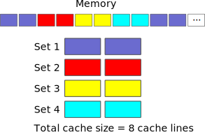
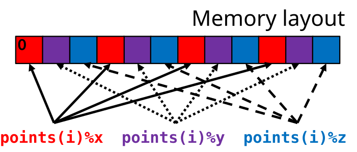
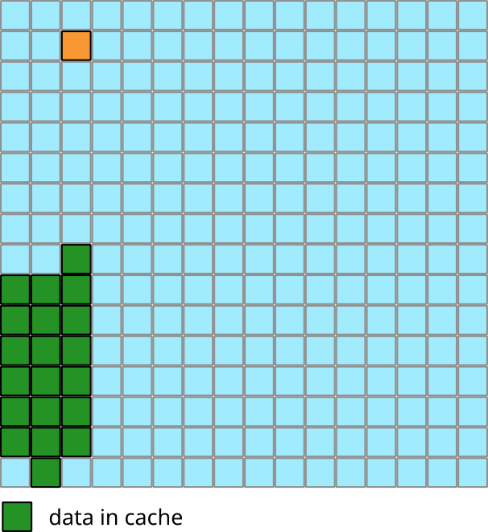
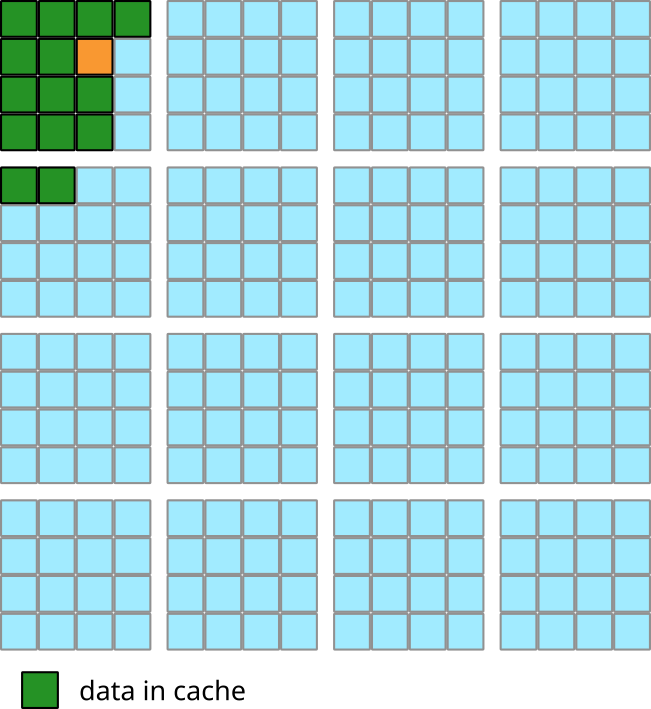
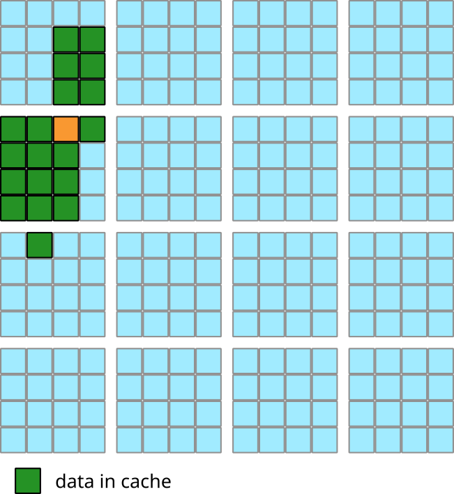

<!--
SPDX-FileCopyrightText: 2021 CSC - IT Center for Science Ltd. <www.csc.fi>

SPDX-License-Identifier: CC-BY-4.0
-->

---
title:  Memory optimization
event:  Node-level Performance Optimization @ CSC
date:   2024-05
lang:   en
---


# Outline

- Deeper view into data caches
- Basic considerations for cache efficiency
    - loop traversal and interchange
    - data structures
- Cache optimization techniques
    - cache blocking


# Deeper view into data caches {.section}

# Data caches

- Modern CPUs use multilevel caches to access data
- Utilize spatial and temporal locality of data: if data is already
  in the cache, latency and bandwidth are improved
- For instance, on Intel Cascade lake
    - L1 cache: latency 4-6 cycles, sustained bandwidth 133 B/cycle/core
    - L2 cache: latency 14 cycles, sustained bandwidth 52 B/cycle/core
    - L3 cache: latency 50-70 cycles, sustained bandwidth 16 B/cycle/core
    - main memory: latency 120-150 ns, bandwidth 128 GB/s per socket


# Data caches

- Sizes of the data caches are small compared to the main memory
    - L1 ~32 KiB
    - L2 512-1024 KiB
    - L3 1-4 MiB / core
- Terminology
    - *cache hit*: the requested data is in the cache
    - *cache miss*: the requested data is not in the cache
- Optimizing the use of caches is extremely important to leverage the full
  power of modern CPUs


# Cache organization

- Cache is read and written in units of **cache lines**
    - 64 bytes in current x86 CPUs
- Upon *miss*, a line is *evicted* from the cache and replaced by the new line
    - cache replacement policy determines which line is evicted
- *Inclusive* cache: all the lines in the upper-level cache are also in the
  lower level
- *Exclusive* cache: lines in the upper-level cache are not in the lower level
- Cache can be also non-inclusive non-exclusive, *i.e.* line may or
  may not be present in lower-level cache


# Cache organization

{.center width=60%}


# Write policies

- Most modern CPUs employ a *write-back* cache write policy
    - a changed cache line is updated in the lower level hierarchy only when
      it is evicted
- Upon write miss, the cache line is typically first read from the main memory
  (*write-allocate* policy)
- In multicore CPUs with private caches, writes may require updates also in
  the caches of the other cores


# Cache associativity

- A cache with the size of 32 KiB can fit 32 KiB / 64 B = 512 cache lines
- In *fully associate* cache, each of the 512 entries can contain any
  memory location
    - each entry needs to be checked for a hit which can be expensive for
      large caches
- In *direct mapped* cache, each memory location maps into exactly one
  cache line
    - part of the cache is not fully utilized if memory addresses are not
      evenly distributed: some cache lines are evicted repeteadly while others
      remain empty


# Cache associativity

- Set associative caches can achieve best of the both worlds: efficient search
  and good utilization


# Set associative cache

- A N-way set associative cache is divided into sets with N cache
  lines in each
    - 8-way set associative 32 KiB cache has 64 sets with 8 cache line
      entries per set
- A memory address is mapped into any entry within a **set**
    - need to search only over N entries for a hit
    - better utilization than in a direct mapped cache, but conflict misses
      still possible
- Fully associative and direct mapped as limiting cases N=$\infty$ and N=1


# Example: 2-way set associative cache

{.center width=60%}


# Types of cache misses

- Compulsory misses: happens the first time a memory address is accessed
    - prefetching may prevent compulsory misses
- Capacity misses: happens when the data is evicted due to cache becoming
  full
    - can be caused by bad spatial and temporal locality of data in the
      application (inherent or bad implementation)
- Conflict misses: happens when a set becomes full even when other sets have
  space
    - can be caused by particular memory access patterns


# Optimizing data access {.section}

# Accessing multidimensional arrays

<div class=column>
- Accessing multidimensional arrays in incorrect order can generate poor
  cache behaviour
- Loops should be written so that the
  <span style="color:var(--csc-blue)">innermost loop index</span> matches the
  <span style="color:var(--csc-blue)">contiguous array index</span>
    - C/C++ uses *row-major* layout, i.e. last index is contiguous
    - Fortran uses *column-major* layout, i.e. first index is contiguous

</div>
<div class=column>
{.center width=70%}
<br>
{.center width=70%}
<br>

- Compiler optimizations may permute the loop indices automatically if possible
</div>


# Loop interchange example: Fortran

<div class="column">
Original loop
```{.fortran emphasize=4-4,6:20-6:20,8-8}
real :: a(N,M)
real :: sum

do i=1,N
  do j=1,M
     sum = sum + a(i,j)
  end do
end do
```
</div>

<div class="column">
Interchanged
```{.fortran emphasize=5-5,6:20-6:20,7-7}
real :: a(N,M)
real :: sum

do j=1,M
  do i=1,N
     sum = sum + a(i,j)
  end do
end do
```
</div>


# Loop interchange example: C/C++

<div class="column">
Original loop
```{.c emphasize=4-4,6:22-6:22}
float **a;
float sum;

for (int i=0; i < M; i++)
  for (int j=0; j < N; j++)
    sum = sum + a[j][i];
```
</div>

<div class="column">
Interchanged
```{.c emphasize=5-5,6:22-6:22}
float **a;
float sum;

for (int j=0; j < N; j++)
  for (int i=0; i < M; i++)
    sum = sum + a[j][i];

```
</div>


# Data structures

- Data structure choice has an effect on the memory layout
    - Structure of Arrays (SoA) vs. Array of Structures (AoS)
- Data should be stored based on its usage pattern
    - avoid scattered memory access
- Occasionally, use of nonconventional ordering or traversal of data is
  beneficial
    - colorings, space filling curves, *etc.*


# Data structures: memory layout

<div class="column">
**Array of Structures**

``` fortran
type point
  real :: x, y, z
end type point

type(point), allocatable :: points

allocate(points(N))
```
</div>
<div class="column">
**Structure of Arrays**

``` fortran
type point
  real, allocatable :: x(:)
  real, allocatable :: y(:)
  real, allocatable :: z(:)
end type point

type(point) :: points

allocate(points%x(N), &
         points%y(N), &
         points%z(N))
```

</div>


# Data structures: memory layout

<div class="column">
**Array of Structures**

``` fortran
integer :: i, j
real :: dist(4,4)
do i = 1, 4
  do j = i, 4
    dist(i,j) = sqrt( &
      (points(i)%x-points(j)%x)**2 + &
      (points(i)%y-points(j)%y)**2 + &
      (points(i)%z-points(j)%z)**2)
  end do
end do
```
<p style="margin-top:-1ex">
{.center width=70% padding-top=0}
</p>

</div>
<div class="column">
**Structure of Arrays**
``` fortran
integer :: i, j
real :: dist(4,4)
do i = 1, 4
  do j = i, 4
    dist(i,j) = sqrt( &
      (points%x(i)-points%x(j))**2 + &
      (points%y(i)-points%y(j))**2 + &
      (points%z(i)-points%z(j))**2)
  end do
end do
```
<p style="margin-top:-1ex">
{.center width=70%}
</p>

</div>


# Cache blocking

- Multilevel loops can be iterated in blocks in order improve data locality
    - perform more computations with the data that is already in the cache
- Complicated optimization: optimal block size is hardware dependent
  (cache sizes, SIMD width, *etc.*)
- Cache oblivious algorithms use recursion to improve performance portability


# Cache blocking example

<div class=column>
- Consider a 2D Laplacian

```fortran
do j = 2, 15
  do i = 2, 15
    a(i,j) = u(i-1, j) + u(i+1, j) &
           - 4*u(i,j)              &
           + u(i,j-1) + u(i,j+1)
  end do
end do
```

- (Fictitious) cache structure
    - Cache can hold 20 elements
    - Fully associative
- No cache reuse between outer loop iterations
</div>
<div class=column>
{.center width=70%}
</div>


# Cache blocking example

<div class=column>
- Iterate over 4 x 4 blocks

```fortran
do JBLOCK = 2, 15, 4
  do IBLOCK = 2, 15, 4
    do j = JBLOCK, JBLOCK + 3
      do i = 1, IBLOCK, IBLOCK + 3
        a(i,j) = u(i-1, j) + u(i+1, j) &
               - 4*u(i,j)              &
               + u(i,j-1) + u(i,j+1)
      end do
    end do
  end do
end do
```

</div>
<div class=column>
{.center width=70%}
</div>


# Cache blocking example

<div class=column>
- Iterate over 4 x 4 blocks

```fortran
do JBLOCK = 2, 15, 4
  do IBLOCK = 2, 15, 4
    do j = JBLOCK, JBLOCK + 3
      do i = 1, IBLOCK, IBLOCK + 3
        a(i,j) = u(i-1, j) + u(i+1, j) &
               - 4*u(i,j)              &
               + u(i,j-1) + u(i,j+1)
      end do
    end do
  end do
end do
```

<div style="font-size:0.9em">
- Without cache blocking: ~1000 misses
- With cache blocking: ~270 misses
</div>

</div>
<div class=column>
{.center width=70%}
</div>


# Cache blocking with OpenMP

- OpenMP 5.1 standard has a `tile` construct for blocking
    - compiler support not necessarily ready yet

```fortran
!$omp tile sizes(4, 4)
do j= 2, 15
  do i = 2 , 15
    a(i,j) = u(i-1, j) + u(i+1, j) &
           - 4*u(i,j)              &
           + u(i,j-1) + u(i,j+1)
  end do
end do
!$omp end tile
```


# Array padding

- When data is accessed in strides that are multiples of the cache set size,
  conflict misses may occur
    - in 8-way associative 32 KiB cache, there are 64 sets
        - memory addresses that are 64*64 = 4096 bytes apart map into the
          same set
    - example: in `float a[1024][1024]` each column maps into the same set
- Array padding, *i.e.* allocating extra data can in some cases reduce
  conflict misses
     - `float a[1024 + 16][1024]`
     - padding should preferably preserve alignment of data


# Prefetching

- Modern CPUs try to predict data usage patterns and prefetch data to
  caches before it is actually needed
    - can alleviate even compulsory misses
- Prefetching can be requested also by software
    - compiler
    - programmer via software directives and intrinsinc functions
    - difficult optimization:
        - too early: cache is filled with unnecessary data
        - too late: CPU has to wait for the data


# Non-temporal stores

- With *write-allocate* policy, a write miss incurs a load from main memory
- If data is going to be just written and not reused, some CPUs contain
  instructions for bypassing the cache by writing directly into the memory
  with *non-temporal stores*
- Non-temporal stores can be used via pragmas, compiler options, or intrinsincs
    - `omp simd nontemporal(list)` (OpenMP 5.0)
    - possible benefits depend a lot on application, and misuse can degragade
      performance
    - hardware may also recognize access pattern and switch into non-temporal
      stores


# Summary

- Efficient cache usage is one of the most important aspects for achieving
  good performance
    - exploit spatial and temporal locality
- Programmer can improve the cache usage by optimizing data layouts and access
  patterns
