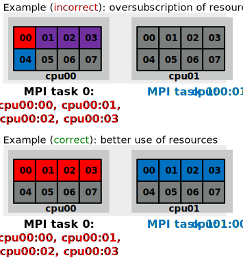

# Thread and process affinity

- Normally, operating system can run threads and processes in any
  logical core
- Operating system may even move running task from one core to another
    - Can be beneficial for load balancing
	- For HPC workloads often detrimental as private caches get
      invalidated
- User can control where tasks are run via affinity masks

# Controlling affinity

- Affinity for a *process* can be set with a `numactl` command
    - Limit the process to logical cores 0,3,7: 
      <br>
      `numactl --physcpubind=0,3,7 ./my_exe`
	- Threads "inherit" the affinity of their parent process
- Affinity of a thread can be set with OpenMP environment variables
    - `OMP_PLACES=[threads,cores,sockets]`
	- `OMP_PROC_BIND=[true, close, spread]`
- OpenMP runtime prints the affinity with `OMP_DISPLAY_AFFINITY=true`

# Controlling affinity

```
export OMP_AFFINITY_FORMAT="Thread %0.3n affinity %A"
export OMP_DISPLAY_AFFINITY=true
./test
Thread 000 affinity 0-7
Thread 001 affinity 0-7
Thread 002 affinity 0-7
Thread 003 affinity 0-7
```


```
OMP_PLACES=cores ./test
Thread 000 affinity 0,4
Thread 001 affinity 1,5
Thread 002 affinity 2,6
Thread 003 affinity 3,7
```


# First touch memory allocation

- Modern OS typically optimizes memory allocations
    - `malloc()` does not allocate the memory directly
	- Only the memory managements "knows" about the allocation, but
	  no memory is made available
	- OS physically allocates the memory only at the first write
      access (*First touch policy*)
- On NUMA systems memory access time between sockets varies
    - Performance can be degragated if the thread *first touching* the
      memory and the thread *using* the memory run in different sockets

# NUMA optimization with OpenMP

- NUMA issues from first touch policy can be mitigated when threads
  are bind and the initialization of arrays is done in a parallel
  region

```
// Initialize data
#pragma omp parallel for
for (int i=0; i < N; i++)
  ...
// Perform work
#pragma omp parallel for
for (int i=0; i < N; i++)
  ...
```

# MPI+OpenMP thread affinity

<div class="column">
- MPI library must be aware of the underlying OpenMP for correct
  allocation of resources
    - Oversubscription of CPU cores may cause significant performance
      penalty
- Additional complexity from batch job schedulers
- Heavily dependent on the platform used!
</div>

<div class="column">
{.center width=70%}
</div>

# Slurm configuration at CSC

- Within a node, `--tasks-per-node` MPI tasks are spread
  `--cpus-per-task` apart
- Threads within a MPI tasks have the affinity mask for the
  corresponging 
  <br>
  `--cpus-per-task` cores
```
export OMP_AFFINITY_FORMAT="Process %P thread %0.3n affinity %A"
export OMP_DISPLAY_AFFINITY=true
srun ... --tasks-per-node=2 --cpus-per-task=4 ./test
Process 250545 thread 000 affinity 0-3
...
Process 250546 thread 000 affinity 4-7
...
```

- Slurm configurations in other HPC centers can be very different
    - Always experiment before production calculations!
  
# Summary

- Performance of HPC is often improved when threads are pinned to CPU
  cores
- NUMA issues may degregate performance if *first touch* memory
  allocation is not considered
- MPI and batch system configurations may affect the affinity

