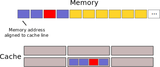
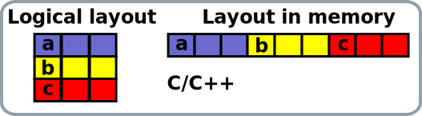
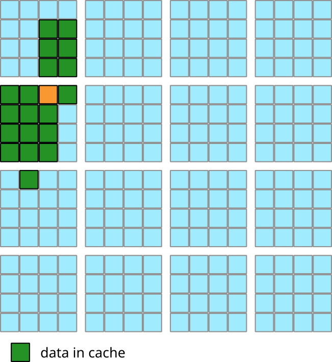

# Outline

- Deeper view into data caches
- Basic considerations for cache efficiency
    - Loop traversal and interchange
	- Data structures
- Cache optimization techniques
    - Cache blocking

# Deeper view into data caches {.section}

# Data caches

- Modern CPUs use multilevel caches to access data
- Utilize spatial and temporal locality of data: if data is already 
  in the cache, latency and bandwidth are improved
- For instance, on Intel Cascade lake
    - L1 cache: latency 4-6 cycles, sustained bandwidth 133 B/cycle/core
    - L2 cache: latency 14 cycles, sustained bandwidth 52 B/cycle/core
	- L3 cache: latency 50-70 cycles, sustained bandwidth 16 B/cycle/core
    - Main memory: latency 120-150 ns, bandwidth 128 GB/s per socket

# Data caches

- Sizes of the data caches are small compared to the main memory
    - L1 ~32 KiB
	- L2 512-1024 KiB
	- L3 1-4 MiB / core
- Terminology
    - *Cache hit*: the requested data is in the cache
    - *Cache miss*: the requested data is not in the cache
- Optimizing the use of caches is extremely important to leverage the full 
  power of modern CPUs

# Cache organization

- Cache is read and written in units of **cache lines**
    - 64 bytes in current x86 CPUs
- Upon *miss*, a line is *evicted* from the cache and replaced by the new line
    - Cache replacement policy determines which line is evicted	
- *Inclusive* cache: all the lines in the upper-level cache are also in the lower level
- *Exclusive* cache: lines in the upper-level cache are not in the lower level
- Cache can be also non-inclusive non-exclusive, *i.e.* line may or
  may not be present in lower-level cache

# Cache organization

{.center width=60%}

# Write policies

- Most modern CPUs employ a *write-back* cache write policy
    - a changed cache line is updated in the lower level hierarchy only when 
	  it is evicted
- Upon write miss, the cache line is typically first read from the main memory (*write-allocate* policy)
- In multicore CPUs with private caches, writes may require updates also in 
  the caches of the other cores

# Cache associativity

- A cache with the size of 32 KiB can fit 32 KiB / 64 B = 512 cache lines
- In *fully associate* cache, each of the 512 entries can contain any 
  memory location 
    - Each entry needs to be checked for a hit which can be expensive for 
	  large caches
- In *direct mapped* cache, each memory location maps into exactly one
  cache line
    - Part of the cache is not fully utilized if memory addresses are not 
	  evenly distributed: some cache lines are evicted repeteadly while others 
	  remain empty
- Set associative caches can achieve best of the both worlds: efficient search
  and good utilization
  
# Set associative cache

- A N-way set associative cache is divided into sets with N cache
  lines in each
    - 8-way set associative 32 KiB cache has 64 sets with 8 cache line 
	  entries per set
- A memory address is mapped into any entry within a **set**
    - need to search only over N entries for a hit
	- better utilization than in a direct mapped cache, but conflict misses
	  still possible
- Fully associative and direct mapped as limiting cases N=$\infty$ and N=1

# Example: 2-way set associative cache

{.center width=60%}

# Types of cache misses

- Compulsory misses: happens the first time a memory address is accessed
    - Prefetching may prevent compulsory misses
- Capacity misses: happens when data the data is evicted due to cache becoming 
  full
    - Can be caused by bad spatial and temporal locality of data in the 
	  application (inherent or bad implementation)
- Conflict misses: happens when a set becomes full even when other sets have 
  space
    - Can be caused by particular memory access patterns
	
# Optimizing data access {.section}

# Accessing multidimensional arrays

<div class=column>
- Accessing multidimensional arrays in incorrect order can generate poor 
  cache behaviour
- Loops should written such that the *innermost* loop index matches the 
  *contiguous* array index
    - C/C++ uses row major layout, i.e. last index is contiguous
	- Fortran uses column major layout, i.e. first index is contiguous

</div>
<div class=column>
{.center width=70%}
<br>
{.center width=70%}
<br>

- Compiler optimizations may permute the loop indices automatically if possible
</div>

# Loop interchage example: Fortran

<div class="column">
Original loop
```{.fortran emphasize=4-4,6:20-6:20,8-8}
real :: a(N,M)
real :: sum

do i=1,N
  do j=1,M
     sum = sum + a(i,j)
  end do
end do
```
</div>

<div class="column">
Interchanged
```{.fortran emphasize=5-5,6:20-6:20,7-7}
real :: a(N,M)
real :: sum

do j=1,M
  do i=1,N
     sum = sum + a(i,j)
  end do
end do
```
</div>

# Loop interchage example: C/C++

<div class="column">
Original loop
```{.c emphasize=4-4,6:22-6:22}
float **a;
float sum;

for (int i=0; i < M; i++)
  for (int j=0; j < N; j++)
    sum = sum + a[j][i];
```
</div>

<div class="column">
Interchanged
```{.c emphasize=5-5,6:22-6:22}
float **a;
float sum;

for (int j=0; j < N; j++)
  for (int i=0; i < M; i++)
    sum = sum + a[j][i];

```
</div>

# Data structures

- Data structure choice has an effect on the memory layout
    - Structure of arrays (SoA) vs. Array of Structures (AoS)
- Data should be stored based on its usage pattern
    - Avoid scattered memory access
- Occasionally, use of nonconventional ordering or traversal of data is 
  beneficial
    - Colorings, space filling curves, *etc.*
	
# Data structures: memory layout

<div class="column">
**Array of Structures**

``` fortran
type point 
  real :: x, y, z
end type point

type(point), allocatable :: points

allocate(points(N))
```
</div>
<div class="column">
**Structure of Arrays**

``` fortran
type point 
  real, allocatable :: x(:) 
  real, allocatable :: y(:) 
  real, allocatable :: z(:)
end type point

type(point) :: points

allocate(points%x(N), & 
         points%y(N), & 
         points%z(N))
```

</div>

# Data structures: memory layout

<div class="column">
**Array of Structures**

``` fortran
integer :: i, j
real :: dist(4,4)
do i = 1, 4
  do j = i, 4 
    dist(i,j) = sqrt( & 
      (points(i)%x-points(j)%x)**2 + &
      (points(i)%y-points(j)%y)**2 + &
      (points(i)%z-points(j)%z)**2)
  end do
end do
```

<center>

{.center width=70%}

</center>

</div>
<div class="column">
**Structure of Arrays**

``` fortran
integer :: i, j
real :: dist(4,4)
do i = 1, 4
  do j = i, 4 
    dist(i,j) = sqrt( & 
      (points%x(i)-points%x(j))**2 + &
      (points%y(i)-points%y(j))**2 + &
      (points%z(i)-points%z(j))**2)
  end do
end do
```

<center>

{.center width=70%}

</center>

</div>

# Cache blocking

- Multilevel loops can be iterated in blocks in order improve data locality
    - Perform more computations with the data that is already in the cache
- Complicated optimization: optimal block size is hardware dependent 
  (cache sizes, SIMD width, *etc.*)
- Cache oblivious algorithms use recursion to improve performance portability

# Cache blocking example

<div class=column>
- Consider a 2D Laplacian

```fortran
do j = 2, 15
  do i = 2, 15
    a(i,j) = u(i-1, j) + u(i+1, j) &
           - 4*u(i,j)              &
           + u(i,j-1) + u(i,j+1)
  end do
end do
```

- (Fictitious) cache structure
    - Cache can hold 20 elements
    - Fully associative
- No cache reuse between outer loop iterations
</div>
<div class=column>
{.center width=70%}
</div>


# Cache blocking example

<div class=column>
- Iterate over 4 x 4 blocks

```fortran
do JBLOCK = 2, 15, 4
  do IBLOCK = 2, 15, 4
    do j = JBLOCK, JBLOCK + 3
      do i = 1, IBLOCK, IBLOCK + 3
        a(i,j) = u(i-1, j) + u(i+1, j) &
               - 4*u(i,j)              &
               + u(i,j-1) + u(i,j+1)
      end do
    end do
  end do
end do
```

</div>
<div class=column>
{.center width=70%}
</div>

# Cache blocking example

<div class=column>
- Iterate over 4 x 4 blocks

```fortran
do JBLOCK = 2, 15, 4
  do IBLOCK = 2, 15, 4
    do j=JBLOCK, JBLOCK + 3
      do i=1, IBLOCK, IBLOCK + 3
        a(i,j) = u(i-1, j) + u(i+1, j) &
               - 4*u(i,j)              &
               + u(i,j-1) + u(i,j+1)
      end do
    end do
  end do
end do
```

- Without cache blocking: ~1000 misses
- With cache blocking: ~270 misses

</div>
<div class=column>
{.center width=70%}
</div>
# Cache blocking with OpenMP

- OpenMP 5.1 standard has `tile` construct for blocking
    - Compiler support not necessarily ready yet

```fortran
!$omp tile sizes(4, 4)
do j= 2, 15 
  do i = 2 , 15
    a(i,j) = u(i-1, j) + u(i+1, j) &
           - 4*u(i,j)              &
           + u(i,j-1) + u(i,j+1)
  end do
end do
!$omp end tile
```

# Array padding

- When data is accessed in strides which are multiple of the cache set size, 
  conflict misses may occur
    - In 8-way associative 32 KiB cache, there are 64 sets
        - Memory address which are 64*64 = 4096 bytes apart map into a same set
    - Example: in `float a[1024][1024]` each column maps into a same set
- Array padding, *i.e.* allocating extra data can in some cases reduce conflict
  misses
     - `float a[1024 + 16][1024]`
     - Padding should preferably preserve alignment of data

# Prefetching

- Modern CPUs try to predict data usage patterns and prefetch data to 
  caches before it is actually needed
    - Can alleviate even compulsory misses
- Prefetching can be requested also by software
    - Compiler
    - Programmer via software directives and intrinsinc functions
    - Difficult optimization: 
        - Too early: cache is filled with unnecessary data
        - Too late: CPU has to wait for the data


# Non-temporal stores

- With *write-allocate* policy, a write miss incurs a load from main memory
- If data is going to be just written and not reused, some CPUs contain 
  instructions for bypassing the cache by writing directly into the memory
  with *non-temporal stores*
- Non-temporal stores can be used via pragmas, compiler options, or intrinsincs
    - `omp simd nontemporal(list)` (OpenMP 5.0)
    - Possible benefits depend a lot on application, and misuse can degragade performance
    - Hardware may also recognize access pattern and switch into non-temporal stores

# Summary

- Efficient cache usage is on of the most important aspects for achieving
  good performance
    - Exploite spatial and temporal locality
- Progammer can improve the cache usage by optimizing data layouts and access
  patterns
